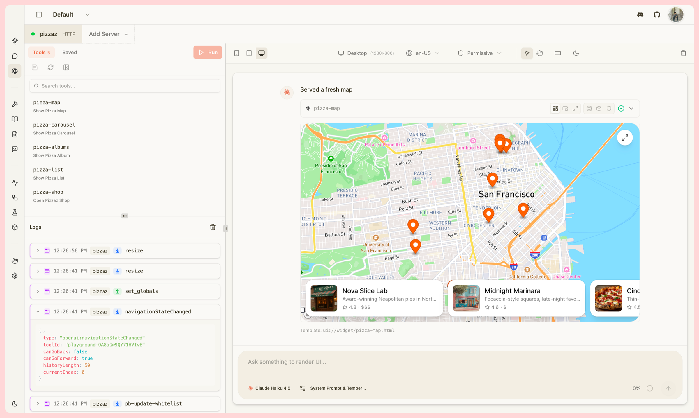
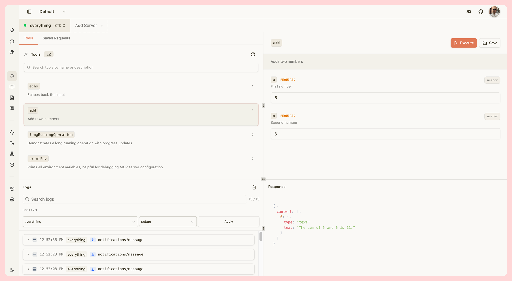
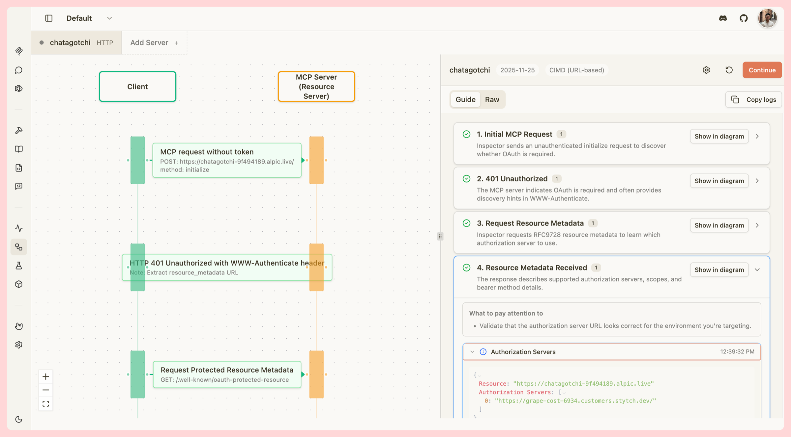
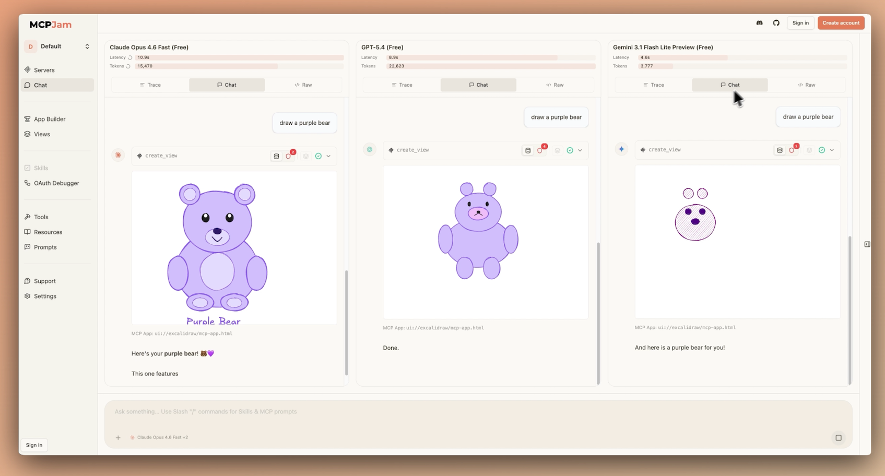
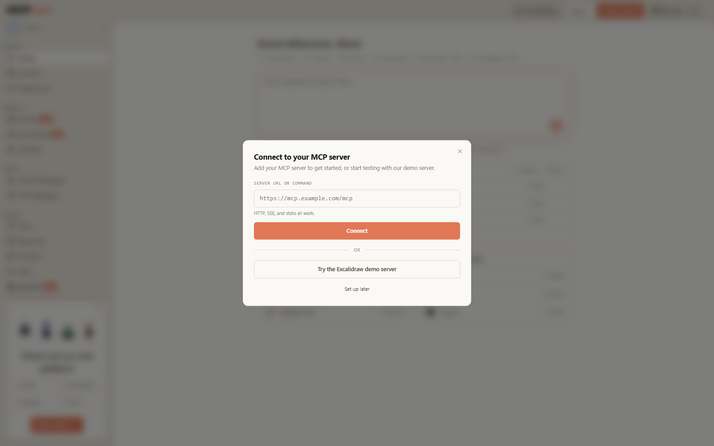

# MCPJam Inspector on Railway

[](https://railway.com/deploy/mcpjam-inspector)

**Test, debug and evaluate any MCP server from a browser — hosted by Railway.**

MCPJam Inspector is the open-source testing and evaluation platform for MCP
server developers. This template builds it from source and runs it behind a
public HTTPS URL, so you get the full Inspector — tools, resources, prompts,
OAuth debugger, ChatGPT-apps / MCP-apps widget emulator and the LLM playground —
without installing Node.js, Docker or a tunnel on your machine.

> **Live deployment of this template:**
> <https://mcpjam-inspector-production.up.railway.app> — running the same service
> with the variables listed below. It is token-gated like every deployment of this
> template, so it asks for an access link.

<!-- markdownlint-disable MD033 -->
| | |
|---|---|
|  |  |
| **Playground** — every tool call, agent step and JSON-RPC message in one timeline | **Server debugging** — invoke tools, resources, prompts and elicitation flows with full logs |
|  |  |
| **OAuth debugger** — step through every message of the handshake | **Client matrix** — score agent behaviour across 16 client configurations |
<!-- markdownlint-enable MD033 -->

_Screenshots from the [MCPJam documentation](https://docs.mcpjam.com)._

This one is not a screenshot of the docs — it is the Railway deployment of this
template, signed in and rendered:



---

## H1: Deploy and Host MCPJam Inspector with Railway

MCPJam Inspector is a local-first developer client for MCP servers, ChatGPT apps
and MCP apps. This template compiles it from the official source tree and runs
it as a single Railway service: a Hono/Node API plus a compiled React client,
bound to port 6274 and published over Railway's HTTPS edge. Access is gated by
the Inspector's own session token, which Railway generates for you, so the
result is a private, shareable inspector URL you can open from any browser.

**Estimated cost: ~US$5–6/month for an always-on deployment** (measured — see
[Cost](#h2-cost)). The image is built once, on Railway, from the pinned source in
this repository, in under five minutes.

## H2: About Hosting MCPJam Inspector

MCPJam Inspector normally runs on your own machine: `npx @mcpjam/inspector`,
a desktop app, or a Docker container bound to `127.0.0.1`. That is the right
tool for day-to-day development, and this template is **not** a replacement for
it — see [When to use the desktop app instead](#when-to-use-the-desktop-app-instead).

What hosting buys you is a URL:

*   **Test from anywhere** — open the inspector on a laptop, a phone, or a
    second machine, with no tunnel, no port forwarding and no `ngrok` account.
*   **Share a live server config** — send a teammate the inspector URL and they
    test the same MCP server, headers and OAuth flow you do, instead of a
    stale JSON snippet.
*   **Keep a standing test rig** — point it at a staging MCP server and
    re-check protocol behaviour any time, without reinstalling anything.
*   **Keep your machine clean** — a server that someone else can probe, without
    your editor, your `~/.config`, your shell or your other localhost ports in
    reach.

The app is a stateless dev tool, so there is no database, no volume and no
migration: one service, one public URL, no data to lose.

## H2: Common Use Cases

*   Reproduce an MCP client's failing call end-to-end — with a URL a teammate
    can open, not a log file.
*   Debug OAuth: walk a provider's `/authorize` → `/token` handshake message by
    message against protocol versions 2025-03-26, 2025-06-18, 2025-11-25 and
    the 2026-07-28 draft, including DCR and CIMD.
*   Render a ChatGPT-apps or MCP-apps widget in the built-in emulator without
    ChatGPT, ngrok or a local dev server.
*   Share one live MCP server configuration with a teammate, an agency client
    or a QA reviewer.
*   Keep a public demo of your MCP server running that prospects can click.

## H2: What the template deploys

| Resource | What it is |
|---|---|
| **1 service** — `MCPJam Inspector` | Built from this repository with upstream's own `mcpjam-inspector/Dockerfile` (Node 24 + Chromium), listening on **port 6274** |
| **1 public domain** | `https://<service>.up.railway.app`, TLS terminated by Railway |
| Health check | `GET /health` — the Inspector's own readiness endpoint, public and unauthenticated by design |
| Volumes | None. The Inspector keeps no durable state |
| Databases | None |

There is nothing to configure before it builds, and no external dependency to
sign up for.

## H2: What works — and what does not — when it is hosted

Read this before you plan around it. A cloud deployment has the full Inspector
feature set, minus the capabilities that are physically about *your* machine.

**Works**

*   Connecting to any **public HTTPS MCP server** (Streamable HTTP and SSE
    transports), including OAuth-protected ones.
*   Tools, resources, resource templates, prompts, elicitation, logging and
    conformance checks.
*   The LLM playground, with your own API key (OpenAI, Anthropic, Google,
    OpenRouter, DeepSeek, Mistral, xAI, Azure, Bedrock, Ollama-compatible
    endpoints). The key is stored in the deployment's variables, not in the app.
*   The ChatGPT-apps and MCP-apps widget emulator, and the OAuth debugger.
*   Any feature that only speaks to a public URL.

**Does not work**

*   **STDIO MCP servers.** A cloud container has no `npx` command of yours, no
    `uvx`, and no project on disk. Use the desktop app or `npx @mcpjam/inspector`
    for STDIO.
*   **The local computer tool** (a shell on the host). It is **disabled by this
    template** — see [Security](#security--read-this-before-sharing-the-url).
*   **The local browser tool** (drives the browser you are sitting in). Also
    disabled.
*   **`localhost` MCP servers** — obviously; they live on your laptop.
*   **Reading your local skills, `~/.mcp`, or a local MCP config file.** Hosted
    mode has no filesystem of yours to read.
*   **Same-origin continuations across tabs** are designed for `127.0.0.1`; on
    a public origin, use one tab.

### When to use the desktop app instead

If you develop against STDIO servers, drive widgets against a local
`localhost` server, or want the Inspector to reach your machine's filesystem,
use the native tooling — it is faster and it is what the project is built for:

```bash
npx @mcpjam/inspector@latest
```

Desktop builds for macOS and Windows are linked from the
[upstream README](UPSTREAM_README.md). This template is for *public servers*
and *sharing*.

## H2: Post-deployment steps

The build compiles a large TypeScript monorepo and downloads Chromium, so it is
not instant — but on Railway's current builders it is measured at **under 5
minutes** end to end (≈3 min build, including the ~80 s image export, plus a few
seconds to first healthy container). Redeploys of an unchanged commit reuse the
cached layers.

1.  **Open the service's deploy log and copy the access link.**

    MCPJam Inspector is not password-protected. Railway generates a private
    session token for your deployment (`MCPJAM_SESSION_TOKEN`, see below) and
    the launcher prints the link that carries it. In the Railway dashboard open
    the service → **Deployments** → the latest successful deployment →
    **Logs**, and look for:

    ```text
    ✔ MCPJam Inspector is ready
      ➜ Open MCPJam
      https://mcpjam-inspector-xxxx.up.railway.app/#token=<your-token>
    ```

2.  **Open that link in a browser.** The `#token=` fragment signs the browser
    in and is stripped from the address bar. The Inspector remembers access for
    that browser until the deployment restarts.

3.  **Treat that link as a password.** Anyone who has it has full control of the
    Inspector: it can call tools on any server you connect, spend the LLM
    credits you supply, and read the API keys you set. Do not post it, do not
    put it in a public issue, and do not share the URL without the fragment.

4.  **Rotate the token if it leaks.** Set `MCPJAM_SESSION_TOKEN` to a new value
    of at least 24 URL-safe characters (`A–Z`, `a–z`, `0–9`, `-`, `_`), then
    redeploy. A quick generator:

    ```bash
    node -e "process.stdout.write(require('crypto').randomBytes(24).toString('base64url'))"
    ```

5.  **Add your own domain** (optional). Right-click the service → *Generate
    domain* → *Custom domain*, then point a CNAME at the Railway target. If you
    do, also update `MCPJAM_INSPECTOR_FRONTEND_URL` and `MCPJAM_ALLOWED_HOSTS`
    (see the variable table) to your new hostname, or the browser's origin
    checks will reject your own requests.

6.  **Add an LLM key if you want the playground** (optional). Set
    `OPENAI_API_KEY`, `ANTHROPIC_API_KEY`, `GOOGLE_GENERATIVE_AI_API_KEY`,
    `OPENROUTER_API_KEY`, `DEEPSEEK_API_KEY`, `MISTRAL_API_KEY`, `XAI_API_KEY`,
    `AZURE_API_KEY` (+ `AZURE_BASE_URL`/`AZURE_API_VERSION`/`AZURE_OPENAI_API_KEY`)
    or `AWS_BEARER_TOKEN_BEDROCK`. Nothing is required to debug a server.

7.  **Connect your MCP server** (optional). Paste an HTTPS server URL into the
    Inspector, or pre-seed one with `MCP_CONFIG_DATA` (see below) and
    `MCP_AUTO_CONNECT_SERVER`.

8.  **Confirm it is healthy.** `curl -sS https://<your-domain>/health` returns
    `{"status":"ok",...}`. The endpoint is intentionally unauthenticated and
    carries no sensitive data; that is what lets Railway health-check it.

## H2: Variables

The template ships with these already set. Change any of them in the service's
**Variables** tab; Railway redeploys the service when you do.

| Variable | Value in this template | What it does |
|---|---|---|
| `MCPJAM_SESSION_TOKEN` | `${{secret(32, "abcdefghijklmnopqrstuvwxyzABCDEFGHIJKLMNOPQRSTUVWXYZ0123456789_-")}}` | **The credential.** 24+ URL-safe chars, required. The access link is `<url>/#token=<value>`. Generated per deployment, rotate it whenever it leaks. |
| `MCPJAM_ALLOWED_HOSTS` | `${{RAILWAY_PUBLIC_DOMAIN}}` | Host allowlist. It opens both the token gate and the browser **Origin** check, so a browser talking to your public URL is not rejected as a cross-site caller. Add a comma-separated list if you add more domains. |
| `ALLOWED_ORIGINS` | `https://${{RAILWAY_PUBLIC_DOMAIN}}` | Exact browser origins allowed to call the API. The host check above is host-based; this one is scheme-and-port exact, so it is the tighter of the two. |
| `MCPJAM_INSPECTOR_FRONTEND_URL` | `https://${{RAILWAY_PUBLIC_DOMAIN}}` | The address the app prints and the one it builds callback URLs from. Without it the launcher would advertise `http://127.0.0.1:6274`. |
| `PORT` | `6274` | The Inspector's fixed port. Railway injects `PORT`; pinning it here keeps Railway's health check and the app on the same port. |
| `MCPJAM_LOCAL_COMPUTER_ENABLED` | `false` | Disables the terminal tool. **Leave disabled on a public deployment** — a shell is a shell whoever signed in. |
| `MCPJAM_LOCAL_BROWSER_ENABLED` | `false` | Disables the "control your browser" tool. Same reasoning. |
| `RAILWAY_HEALTHCHECK_TIMEOUT_SEC` | `600` | How long Railway waits for `/health` before failing the deployment. Raised from the 300 s default because the first container start initialises the Inspector's services before it serves. |

Optional, only if you use the corresponding feature:

| Variable | Purpose |
|---|---|
| `OPENAI_API_KEY`, `ANTHROPIC_API_KEY`, `GOOGLE_GENERATIVE_AI_KEY`, `OPENROUTER_API_KEY`, `DEEPSEEK_API_KEY`, `MISTRAL_API_KEY`, `XAI_API_KEY` | LLM keys for the playground |
| `AZURE_API_KEY` / `AZURE_OPENAI_API_KEY`, `AZURE_BASE_URL`, `AZURE_API_VERSION`, `AZURE_DEPLOYMENT` | Azure OpenAI |
| `AWS_BEARER_TOKEN_BEDROCK`, `AWS_REGION` | Amazon Bedrock |
| `MCP_CONFIG_DATA` | A `mcpServers` map, as JSON, pre-loaded into the UI |
| `MCP_AUTO_CONNECT_SERVER` | Name of a server in `MCP_CONFIG_DATA` to connect to on boot |
| `VERBOSE_LOGS` | `true` to log every HTTP request (URLs are token-scrubbed) |

`${{RAILWAY_PUBLIC_DOMAIN}}` is a Railway-provided variable, so these follow
your domain automatically. If you add a custom domain, update the two
allowlist variables by hand.

> **The deploy form shows some of these as inputs.** Railway lists the four
> variables whose values are literal — `PORT`, `MCPJAM_LOCAL_COMPUTER_ENABLED`,
> `MCPJAM_LOCAL_BROWSER_ENABLED` and `RAILWAY_HEALTHCHECK_TIMEOUT_SEC` — as
> fields to confirm on the deploy screen. Accept the template's values.
>
> **Do not blank the two `false` flags.** They are read as
> `process.env.MCPJAM_LOCAL_COMPUTER_ENABLED !== "false"`, so an empty value is
> not "off" — it *enables* the shell tool. Leaving them blank is the one way to
> get a public terminal on a public URL.

## H2: Cost

Railway is usage-based: you pay for the vCPU-seconds, GB-seconds, volume GB and
egress you actually consume, and the limits you set are **caps, not
reservations**. A cap of 2 GB does not bill 2 GB — it bills what the process
uses.

Measured on a live deployment of this template (Inspector open, no MCP server
connected), against Railway's published rates of **US$10 per GB-month of memory**,
**US$20 per vCPU-month of CPU** and **US$0.05 per GB of egress**:

| Resource | Measured | Billed |
|---|---|---|
| Memory | **0.46 GB** resident at idle (0.63 GB peak during startup) | ≈ **US$4.60 / month** if left running 24/7 |
| CPU | **0.02 %** of one vCPU idle; rises while a tool call streams | ≈ US$0 idle, typically well under US$1 |
| Egress | a few MB per session | < US$0.01 |
| Plan | — | from US$5 / month |

**≈ US$5–6 per month** for an always-on deployment. Browser testing traffic
(connecting to the servers you inspect) is the only cost that scales with use.

Set your own ceiling so a runaway loop cannot become a surprise bill: service →
**Settings** → *Usage Limits*. The limits this template ships with (2 vCPU /
4 GB) are **ceilings, not reservations**: Railway bills the memory and CPU the
process actually consumes, so a generous cap costs nothing until it is used, and
it is what keeps Chromium-heavy sessions from being OOM-killed.

The cheapest configuration is **App Sleeping** (Settings → *Sleep Application*):
the service idles at near-zero cost and wakes on the next request, taking a few
seconds. The access link keeps working across sleeps, because the token is
pinned in a variable rather than generated per boot — but in-memory state
(connected servers, logs, playground conversations) is lost, so do not sleep a
deployment whose sessions you are in the middle of using.

## H2: Security — read this before sharing the URL

*   **The URL plus the token is the whole security model.** There is no user
    account, no login and no rate limit. Treat the access link like an SSH
    deploy key. Railway generates the token for you at deploy time, so nobody
    else knows it unless you publish it.
*   **The Inspector is a client for servers *you* choose.** Anyone signed in can
    make it open an MCP server and call its tools, and can spend the LLM credits
    in your variables. Do not deploy it on a public URL and walk away if the
    tools behind it can mutate data.
*   **The terminal and browser tools are disabled by default here.** That is
    deliberate; re-enabling `MCPJAM_LOCAL_COMPUTER_ENABLED` on a public
    deployment hands a shell to anyone with the link. Inside a container it is
    not your laptop's shell, but it is still an arbitrary shell.
*   **Prefer a custom domain you can revoke.** The `*.up.railway.app` hostname
    is guessable from your project name; a domain you control can be pointed
    somewhere else or taken down.
*   **The origin allowlist is not a firewall.** `MCPJAM_ALLOWED_HOSTS` exists
    to stop browsers *and* DNS rebinding, not to decide who may connect. Access
    control is the token.
*   **Do not paste third-party API keys you care about.** They live in the
    deployment's variables and are used by whatever the Inspector is asked to do.
*   **A safer posture: put Railway in front of your own team only.** Share the
    link with a handful of people, rotate the token when someone leaves, and
    delete the service when the work is done. This is a development tool, not a
    production front end.

## H2: Troubleshooting

**The build fails during `npm ci` or `npx playwright install --with-deps`.**
The image downloads Chromium from `cdn.playwright.dev` and Debian packages from
the apt mirrors. A build failure there is an egress problem, not a code
problem — retry the deployment, and check the build log for the exact host it
could not reach.

**The build is killed part-way (out of memory).**
The build compiles a large TypeScript monorepo and needs a few GB of memory. If
your plan is tight, upgrade for the first build, then reduce the runtime limits.

**The deployment succeeds but the health check times out.**
`/health` must answer `2xx` within 300 s of the container starting. The
Inspector waits for its local services to initialise before it serves; the first
start is the slowest. Raise `RAILWAY_HEALTHCHECK_TIMEOUT_SEC` (e.g. `600`) and
redeploy, or check the deploy log for a crash instead of a slow start.

**The page loads but every request returns `403 {"error":"Forbidden"}`.**
That is the origin check: your browser's origin is not in the allowlist. Set
`MCPJAM_ALLOWED_HOSTS` to your exact hostname (no scheme, no path) and
`ALLOWED_ORIGINS` to `https://<hostname>`, then redeploy. If you added a custom
domain, this is the usual cause.

**The page loads and I get a "Session token required" / "Invalid session
token" error.**
The link lost its fragment, or the token changed. Copy the whole link from the
deploy log including `#token=…`, or open
`https://<your-domain>/#token=<MCPJAM_SESSION_TOKEN>`. Redeploys keep the token
if it comes from the variable; if you never set one, Railway generated a new
one on every deployment.

**A plain URL shows instructions instead of the app.**
By design: the Inspector wants to be opened through the access link so it can
sign the browser in.

**WebSocket connections drop, or the playground stream stalls.**
Railway's edge supports WebSockets but closes idle connections. If you see it
on a long-running eval, keep the tab active; if it is reproducible, check the
deploy log for `[Security]` lines before assuming the network is at fault.

**Widget rendering reports the browser is unavailable.**
Chromium is baked into the image, but Railway's sandbox can deny it the
syscalls it wants. Core inspection, logging, OAuth and the playground are
unaffected; only synthetic widget rendering is.

**I want the local terminal or browser tools back.**
Set `MCPJAM_LOCAL_COMPUTER_ENABLED=true` / `MCPJAM_LOCAL_BROWSER_ENABLED=true`
— only if you have read the security section and accept that the link now grants
that capability.

## H2: Why deploy MCPJam Inspector on Railway?

*   **One click to a working URL.** No `node`, no `docker`, no `ngrok`, no
    firewall rule, and no second machine.
*   **The build is reproducible.** This repository vendors the upstream source
    at a pinned commit and builds it with upstream's own Dockerfile, so a
    deployment is a known-good artifact rather than a moving branch.
*   **HTTPS by default.** Railway terminates TLS and redirects plain HTTP, so
    the Inspector is served over a certificate instead of a self-signed
    warning — which matters, because browsers will not grant a widget iframe the
    permissions it needs over plain HTTP.
*   **It scales with the work, not the project.** Test one server on a small
    cap; raise the limit or add replicas when a team is leaning on it.
*   **It is cheap and disposable.** No database to provision, no volume to pay
    for, no state to migrate. Sleeping or deleting the service is a complete
    off switch.
*   **No lock-in in the app.** The same Inspector runs from `npx`, a desktop
    app or a container. Railway hosts it; it does not own it.

## H2: About this repository

This is a **community deployment packaging**, not the upstream product. It
vendors the [MCPJam Inspector source](https://github.com/MCPJam/inspector) at a
pinned commit and changes no application code, no Dockerfile and no dependency
— see [`NOTICE`](NOTICE) for the full list of differences and
[`UPSTREAM_COMMIT`](UPSTREAM_COMMIT) for the pin.

*   **Template:** <https://railway.com/deploy/mcpjam-inspector>
*   **Marketplace overview:** [`TEMPLATE.md`](TEMPLATE.md) — the compressed
    version Railway renders on the template page (its 10,000-character cap is why
    the full guide lives here).
*   Upstream: <https://www.mcpjam.com> · <https://docs.mcpjam.com> ·
    <https://app.mcpjam.com>
*   Upstream README (verbatim): [`UPSTREAM_README.md`](UPSTREAM_README.md)
*   Upstream AGENTS.md (verbatim): [`UPSTREAM_AGENTS.md`](UPSTREAM_AGENTS.md)
*   License: Apache License 2.0, © MCPJam — [`LICENSE`](LICENSE)
*   Not endorsed by, affiliated with, or supported by MCPJam. Issues with the
    Inspector itself belong [upstream](https://github.com/MCPJam/inspector/issues);
    issues with this packaging belong in this repository.
